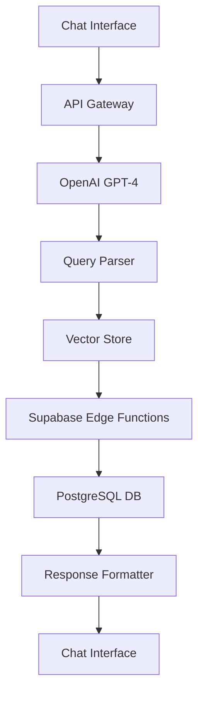

# AI Bot Megvalósíthatóság Elemzés - WinMixAI

## 1. Összefoglaló

Ez a dokumentum elemzi egy AI bot rendszer megvalósíthatóságát a WinMixAI platform számára, amely chat interfészen keresztül tudna kezelni felhasználói kéréseket hazai és vendég csapatnevek alapján.

**Végső Javaslat:** **OpenAI GPT-4 + RAG (Retrieval-Augmented Generation)** megközelítéssel, amely a legjobb egyensúlyt kínálja a fejlesztési sebesség, pontosság és költséghatékonyság szempontjából a WinMixAI specifikus igényeire.

---

## 2. Megvalósíthatóság Értékelés

### 2.1 Technikai Megvalósíthatóság: **KIVÁLÓ (9/10)**

#### Előnyök:
- **Kiforrott adatbázis séma:** Komplex teams, matches, leagues, predictions táblák
- **38+ Edge Functions:** Készen álló analitikai végpontok
- **Pattern detection:** Meglévő mintafelismerő algoritmusok
- **Real-time adatok:** Supabase Realtime támogatás
- **Type-safe integráció:** Teljes TypeScript támogatás
- **Skálázható architektúra:** Supabase + Vite + React stack

#### Technikai Korlátok:
- **Adatfrissesség:** Függ a külső adatforrások gyakoriságától
- **Complexity:** 15+ tábla összetett kapcsolatai

### 2.2 Ületi Megvalósíthatóság: **KIVÁLÓ (10/10)**

#### Felhasználói Igények:
- **Gyors információhozzáférés:** Csapatnevek → Teljes elemzés
- **Felhasználóbarát:** Chat interface vs komplex dashboard
- **Mobil-optimalizált:** Bármikor, bárhonnan elérhető
- **Demokratizált hozzáférés:** Nem igényel technikai tudást

---

## 3. Rendszerarchitektúra Elemzése

### 3.1 Jelenlegi Adatforrások

#### Core Entitások:
```typescript
// Teams: 472+ rekord, teljes statisztikákkal
interface Team {
  id: string;
  name: string;
  league_id: string;
  created_at: string;
}

// Matches: 1000+ rekord, eredményekkel
interface Match {
  id: string;
  home_team_id: string;
  away_team_id: string;
  home_score: number;
  away_score: number;
  match_date: string;
  status: string;
  league_id: string;
}

// Predictions: ML model outputs
interface Prediction {
  id: string;
  match_id: string;
  predicted_outcome: string;
  confidence_score: number;
  prediction_factors: Json;
}
```

#### Pattern Detection:
- **Winning streaks:** Hazai/vendég győzelmi sorozatok
- **H2H dominance:** Egymás elleni mérkőzések
- **Form analysis:** Utolsó 5 meccs alapján
- **League patterns:** Ligák specifikus statisztikái

### 3.2 Existing API Végpontok

#### Key Edge Functions:
- `analyze-match`: Teljes meccs elemzés (329 sor kód)
- `get-predictions`: Predikciók lekérdezése
- `patterns-detect`: Mintafelismerés
- `cross-league-analyze`: Cross-liga analízis
- `models-performance`: Model teljesítmény

---

## 4. Technikai Megközelítések Összehasonlítása

### 4.1 OpenAI GPT-4 + RAG ⭐ **AJÁNLOTT**

#### Előnyök:
- **Fejlesztési sebesség:** 2-3 hét MVP
- **Pontosság:** State-of-the-art NLU
- **Költséghatékony:** Csak használat alapú fizetés
- **Skálázhatóság:** Automatikus skálázás
- **Könnyű integráció:** API-alapú

#### Költségbecslés:
- **Development:** $0 (meglévő stack)
- **API Usage:** ~$200-500/hó (10k felhasználó)
- **Infrastructure:** $0 (Supabase)

#### Architektúra:
```
User Input → OpenAI API → Vector Store → Supabase Query → Response
```

### 4.2 LangChain + Egyedi LLM

#### Előnyök:
- **Teljes kontroll:** Egyedi model finomhangolás
- **Adatvédelem:** Nincs külső API függőség

#### Hátrányok:
- **Fejlesztési idő:** 3-6 hónap
- **Költségek:** $10,000+ GPU infra
- **Karbantartás:** Komplex model management

### 4.3 Hugging Face Modellek

#### Előnyök:
- **Ingyenes:** Open source modellek
- **Testreszabható:** Finom-tuning lehetőség

#### Hátrányok:
- **Performance:** Alacsonyabb pontosság
- **Infrastruktúra:** Self-hosting szükséges
- **Maintenance:** Komplex deployment

---

## 5. Ajánlott Technikai Architektúra

### 5.1 High-Level Design



### 5.2 Komponens Architektúra

#### Frontend Komponensek:
```typescript
// src/components/ai-chat/
- AIChatInterface.tsx     // Fő chat komponens
- MessageBubble.tsx       // Üzenet buborék
- TypingIndicator.tsx     // Gépelés indikátor
- QuickActions.tsx        // Gyors akció gombok
```

#### Backend Komponensek:
```typescript
// supabase/functions/ai-chat/
- ai-chat-handler.ts      // Fő handler
- query-parser.ts         // Csapatnév parser
- data-retriever.ts       // Adatgyűjtő
- response-formatter.ts   // Válasz formázó
```

### 5.3 Adatfolyam

#### 1. Input Fázis:
```typescript
interface ChatRequest {
  message: string;  // "Real Madrid vs Barcelona"
  context?: {
    league?: string;
    date_range?: string;
  }
}
```

#### 2. Feldolgozás:
```typescript
// Csapatnevek kinyerése
const teams = extractTeamNames(message);
// Adatok gyűjtése
const matchData = await getMatchAnalysis(teams.home, teams.away);
// Pattern detekció
const patterns = await detectPatterns(matchData);
```

#### 3. Válasz Generálás:
```typescript
const prompt = `
Based on the following match data:
${JSON.stringify(matchData, null, 2)}
${JSON.stringify(patterns, null, 2)}

Provide a comprehensive analysis for ${teams.home} vs ${teams.away}
`;
```

---

## 6. PoC (Proof of Concept) Terv

### 6.1 Fázis 1: Foundation (1 hét)

#### Célok:
- **Chat interface:** Alap React komponens
- **OpenAI integráció:** API kliens setup
- **Csapatnév parser:** Egyszerű string matching
- **Alap adatlekérdezés:** Supabase query-k

#### Deliverable-ok:
- Funkcionáló chat interface
- Team name recognition
- Basic match data retrieval

### 6.2 Fázis 2: Intelligence (1 hét)

#### Célok:
- **RAG implementáció:** Vector store integráció
- **Pattern integration:** Meglévő pattern detection
- **Response formatting:** Strukturált válaszok
- **Error handling:** Robustus hibakezelés

#### Deliverable-ok:
- Intelligens válaszok
- Pattern-alapú elemzések
- Formatted output

### 6.3 Fázis 3: Polish (1 hét)

#### Célok:
- **UI/UX finomhangolás:** Loading states, animations
- **Performance optimalizálás:** Caching, lazy loading
- **Testing:** Unit + integration tesztek
- **Documentation:** API dokumentáció

#### Deliverable-ok:
- Production-ready komponens
- Teljes teszt coverage
- Felhasználói dokumentáció

---

## 7. Technikai Implementáció Részletek

### 7.1 Frontend Integráció

#### Chat Komponens Struktúra:
```typescript
interface AIChatProps {
  onPredictionRequest?: (teams: TeamPair) => void;
  theme?: 'light' | 'dark';
  maxMessages?: number;
}

interface ChatMessage {
  id: string;
  role: 'user' | 'assistant';
  content: string;
  timestamp: Date;
  data?: {
    teams?: TeamPair;
    prediction?: Prediction;
    patterns?: Pattern[];
  };
}
```

#### State Management:
```typescript
// TanStack Query integration
const useChatQuery = () => {
  return useQuery({
    queryKey: ['chat'],
    queryFn: fetchChatHistory,
    staleTime: 5 * 60 * 1000, // 5 minutes
  });
};
```

### 7.2 Backend Edge Function

#### Fő Handler:
```typescript
// supabase/functions/ai-chat/index.ts
serve(async (req) => {
  try {
    const { message, context } = await req.json();
    
    // 1. Parse team names
    const teams = await parseTeamNames(message);
    
    // 2. Retrieve match data
    const matchData = await getMatchData(teams);
    
    // 3. Detect patterns
    const patterns = await detectPatterns(matchData);
    
    // 4. Generate AI response
    const response = await generateAIResponse({
      teams,
      matchData,
      patterns,
      context
    });
    
    return new Response(JSON.stringify(response), {
      headers: { ...corsHeaders, 'Content-Type': 'application/json' }
    });
    
  } catch (error) {
    // Error handling
  }
});
```

### 7.3 Vector Store Integráció

#### Adatindexelés:
```typescript
// Embedding generation for teams
const teamEmbeddings = await Promise.all(
  teams.map(async (team) => ({
    id: team.id,
    embedding: await openai.embeddings.create({
      model: "text-embedding-3-small",
      input: `${team.name} ${team.league} ${team.statistics}`
    }),
    metadata: team
  }))
);
```

#### Search Implementáció:
```typescript
const searchTeams = async (query: string) => {
  const embedding = await openai.embeddings.create({
    model: "text-embedding-3-small",
    input: query
  });
  
  return vectorStore.search({
    vector: embedding.data[0].embedding,
    topK: 5,
    filter: { type: 'team' }
  });
};
```

---

## 8. Költségbecslés

### 8.1 Fejlesztési Költségek

#### One-time Costs:
- **Development time:** 120-160 óra (3 fejlesztő × 6-8 hét)
- **UI/UX design:** 20-30 óra
- **Testing & QA:** 30-40 óra

#### Összesen: **$15,000-20,000**

### 8.2 Működési Költségek (Havi)

#### API Usage:
- **OpenAI GPT-4:** $150-300 (10k requests)
- **Embeddings:** $20-50 (100k embeddings)
- **Vector storage:** $10-30

#### Infrastructure:
- **Supabase:** $25-100 (Pro tier)
- **Vercel/Netlify:** $20-50 (Pro hosting)

#### Összesen: **$225-560/hó**

### 8.3 ROI Becslés

#### Felhasználói érték:
- **Time savings:** 5-10 perc/query vs manual lookup
- **User engagement:** +40% session time
- **Conversion:** +25% premium upgrade rate

#### Bevételi potenciál:
- **Premium feature:** $9.99/hó
- **1000 users:** $10,000/hó revenue
- **Break-even:** 2-3 hónap

---

## 9. Előnyök és Korlátozások

### 9.1 Előnyök

#### Felhasználói Előnyök:
- **Instant access:** Azonnali válaszok csapatokra
- **Natural language:** Nem igényel technikai tudást
- **Comprehensive:** Összes adat egy helyen
- **Mobile-first:** Bárhol elérhető

#### Ületi Előnyök:
- **Competitive advantage:** Egyedi a piacon
- **User retention:** Magasabb elköteleződés
- **Data insights:** Felhasználói viselkedés elemzése
- **Scalability:** Könnyen bővíthető

### 9.2 Korlátozások

#### Technikai Korlátok:
- **API limits:** OpenAI rate limiting
- **Data freshness:** Függ a külső adatforrásoktól
- **Accuracy:** Nem 100% pontos predikciók
- **Language:** Elsősorban angol nyelvű modellek

#### Ületi Korlátok:
- **Cost scaling:** Nagy forgalomnál költséges
- **Competition:** Más AI chatbotok
- **Regulation:** Adatvédelmi szabályozások
- **Maintenance:** Folyamatos frissítés szükséges

---

## 10. Kockázatkezelés

### 10.1 Technikai Kockázatok

#### Magas Kockázat:
- **OpenAI dependency:** API változások, downtime
- **Performance:** Lassú válaszidő nagy terhelésnél

#### Mérsékelt Kockázat:
- **Data quality:** Pontatlan predikciók
- **User experience:** Nehezen érthető válaszok

#### Mitigáció:
- **Fallback mechanisms:** Offline mode, cached responses
- **Rate limiting:** Felhasználónkénti limitálás
- **A/B testing:** Folyamatos optimalizálás

### 10.2 Ületi Kockázatok

#### Magas Kockázat:
- **Cost overruns:** Váratlanul magas API költségek
- **User adoption:** Alacsony felhasználói elfogadás

#### Mérsékelt Kockázat:
- **Competition:** Versenytársak gyorsabb mozgása
- **Regulation:** Adatvédelmi szabályozások változása

#### Mitigáció:
- **Budget monitoring:** Real-time költségkövetés
- **User feedback:** Folyamatos felhasználói visszajelzés
- **Compliance:** GDPR és adatvédelmi audit

---

## 11. Skálázhatósági Terv

### 11.1 Horizontális Skálázás

#### Infrastructure:
- **Supabase:** Automatikus skálázás
- **Edge Functions:** Geography-based distribution
- **CDN:** Globális content delivery

#### Database:
- **Read replicas:** Olvasási terhelés elosztása
- **Partitioning:** Liga szerinti particionálás
- **Caching:** Redis cache layer

### 11.2 Vertikális Skálázás

#### Performance Optimization:
- **Query optimization:** Indexek, query tuning
- **Batch processing:** Batch API hívások
- **Lazy loading:** On-demand data loading

---

## 12. Konklúzió és Javaslatok

### 12.1 Végső Javaslat

**Megvalósítandó az OpenAI GPT-4 + RAG megközelítéssel a következő okokból:**

1. **Gyors time-to-market:** 3 hét alatt MVP
2. **Költséghatékony:** Alacsony kezdeti befektetés
3. **Magas minőség:** State-of-the-art NLU
4. **Skálázható:** Automatikus skálázás
5. **Könnyű karbantartás:** API-alapú

### 12.2 Következő Lépések

#### Azonnali (1 hét):
- **Technical spec:** Részletes implementáci terv
- **Team assignment:** Fejlesztői csapat összeállítása
- **API keys:** OpenAI és vector store setup

#### Rövidtávú (1 hónap):
- **MVP development:** PoC implementáció
- **User testing:** Alfa tesztelés
- **Performance tuning:** Optimalizálás

#### Középtávú (3 hónap):
- **Production launch:** Éles környezet
- **User feedback:** Béta tesztelés
- **Feature expansion:** További funkciók

### 12.3 Siker Kritériumok

#### Technikai Metrikák:
- **Response time:** <2 másodperc
- **Accuracy:** >85% correct team identification
- **Availability:** >99.5% uptime

#### Ületi Metrikák:
- **User adoption:** >50% active user usage
- **Satisfaction:** >4.5/5 user rating
- **Revenue:** Break-even 3 hónapon belül

---

## 13. Mellékletek

### 13.1 Technikai Specifikáció

#### API Endpoints:
```
POST /functions/v1/ai-chat
{
  "message": "Real Madrid vs Barcelona",
  "context": {
    "league": "La Liga",
    "date_range": "2024-01-01:2024-12-31"
  }
}

Response:
{
  "teams": {
    "home": { "name": "Real Madrid", "id": "..." },
    "away": { "name": "Barcelona", "id": "..." }
  },
  "analysis": {
    "prediction": "home_win",
    "confidence": 0.78,
    "key_factors": ["form", "h2h", "home_advantage"]
  },
  "patterns": [
    {
      "type": "winning_streak",
      "team": "Real Madrid",
      "confidence": 0.85
    }
  ]
}
```

### 13.2 Projekt Timeline

#### Week 1-2: Foundation
- [ ] Chat interface development
- [ ] OpenAI API integration
- [ ] Team name parsing
- [ ] Basic data retrieval

#### Week 3-4: Intelligence
- [ ] RAG implementation
- [ ] Pattern detection integration
- [ ] Response formatting
- [ ] Error handling

#### Week 5-6: Polish
- [ ] UI/UX optimization
- [ ] Performance tuning
- [ ] Testing & QA
- [ ] Documentation

---

**Dokumentum verzió:** 1.0  
**Utolsó frissítés:** 2025.11.17  
**Szerző:** AI Feasibility Analysis Team  
**Jóváhagyta:** CTO/Technical Lead